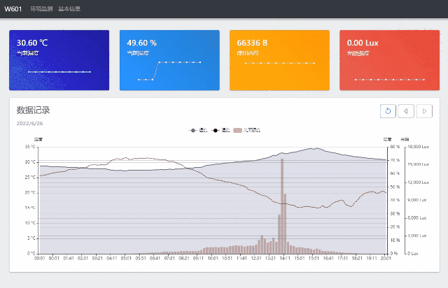
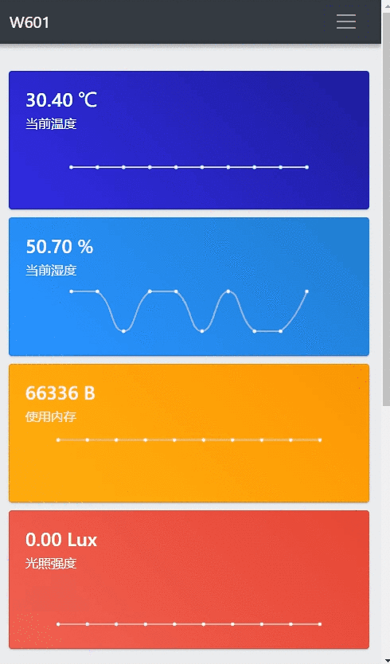

# W601 WEB 2.0

## 效果展示
#### 桌面端效果

#### 移动端效果

#### 在线演示
[部署效果查看](http://w601.wkjay.com "W601 WEB 2.0") (由于该W601部署环境经常变化，有时可能无法正常访问。)

## 工程使用

#### Project setup
```
yarn install
```

#### Compiles and hot-reloads for development
```
yarn serve
```

#### Compiles and minifies for production
```
yarn build
```

#### Lints and fixes files
```
yarn lint
```

#### Customize configuration
See [Configuration Reference](https://cli.vuejs.org/config/).
